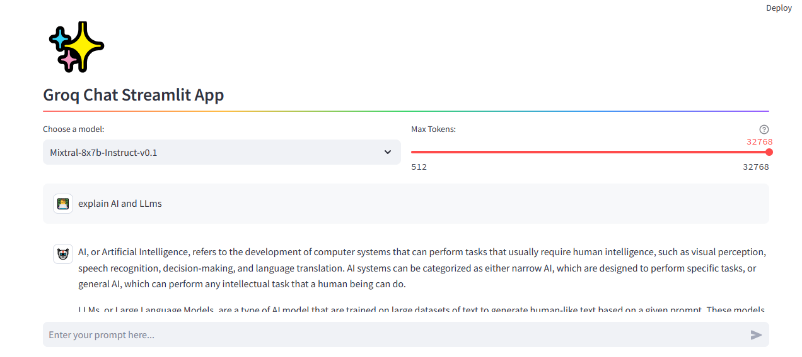

# Groq Chat Streamlit App

[](https://groqdemo.streamlit.app/)



This [Streamlit](https://streamlit.io/) app integrates with the [Groq API](https://groq.com/) to provide a chat interface where users can interact with advanced language models. It allows users to choose between two models for generating responses, enhancing the flexibility and user experience of the chat application.

## Features

- **Model Selection**: Users can select between `mixtral-8x7b-32768`, `llama2-70b-4096`, `Gemma-7b-it`, `llama2-70b-4096`, `llama3-70b-8192`, and `lama3-8b-8192` models to tailor the conversation according to each model's capabilities.
- **Chat History**: The app maintains a session-based chat history, allowing for a continuous conversation flow during the app session.
- **Dynamic Response Generation**: Utilizes a generator function to stream responses from the Groq API, providing a seamless chat experience.
- **Error Handling**: Implements try-except blocks to handle potential errors gracefully during API calls.

## Requirements

- Streamlit
- Groq Python SDK
- Python 3.7+

## Setup and Installation

- **Install Dependencies**:

  ```bash
  pip install streamlit groq
  ```

- **Set Up Groq API Key**:

  Ensure you have an API key from Groq. This key should be stored securely using Streamlit's secrets management:

  ```toml
  # .streamlit/secrets.toml
  GROQ_API_KEY="your_api_key_here"
  ```

- **Run the App**:
  Navigate to the app's directory and run:

```bash
streamlit run streamlit_app.py
```

## Usage

Upon launching the app, you are greeted with a title and a model selection dropdown.

After choosing a preferred model, you can interact with the chat interface by entering prompts.